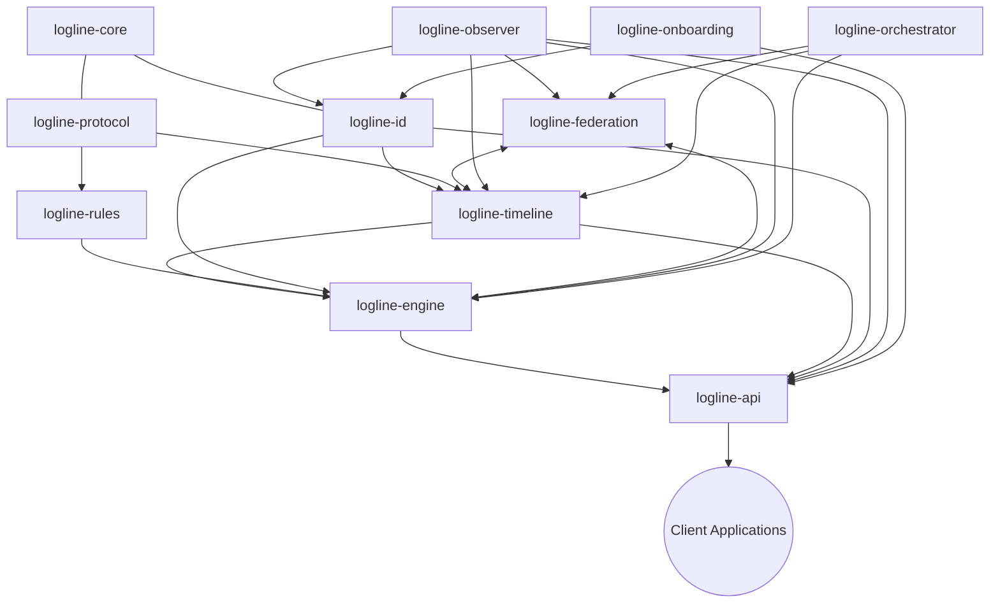

````markdown
# LogLine Architecture - Microservices Implementation

## Core Design Philosophy

LogLine is designed as a microservices-based, distributed system for computational contracts and auditable timelines. This document outlines the architecture that resolves the circular dependencies while maintaining clean separation of concerns, with each component deployed as an independent service.

## Microservices Overview



## Microservices Dependencies & Bootstrap Process

### Initial Bootstrap (Breaking Circular Dependencies)
1. **logline-core** and **logline-protocol** - Shared libraries deployed first
2. **Shared Database Infrastructure** - PostgreSQL and Redis instances
3. **logline-id** - Identity service with minimal dependencies
4. **logline-timeline** - Timeline service that depends on ID
5. **logline-rules** and **logline-engine** - Processing services
6. **logline-federation** and **logline-orchestrator** - Network services
7. **logline-observer** and **logline-onboarding** - Support services
8. **logline-api** - API Gateway for client access

### Detailed Deployment Process

#### 1. Foundation Services Deployment

1. **Deploy shared infrastructure**
   ```bash
   # Create PostgreSQL and Redis instances on Railway
   railway add postgresql
   railway add redis
   ```

2. **Deploy logline-id service**
   ```bash
   # In logline-id repository
   railway up --service logline-id
   ```
   - Service begins accepting identity creation/verification requests
   - Exposes REST API endpoints and WebSocket server
   - Configuration includes database connection strings

3. **Deploy logline-timeline service**
   ```bash
   # In logline-timeline repository  
   railway up --service logline-timeline
   ```
   - Service connects to PostgreSQL for persistent storage
   - Links to logline-id service for identity verification
   - Exposes REST API for timeline operations

#### 2. Processing Layer Deployment

4. **Deploy logline-rules service**
   ```bash
   # In logline-rules repository
   railway up --service logline-rules
   ```
   - Loads grammar definitions from storage
   - Configures rule execution environment
   - Links to shared Redis for rule caching

5. **Deploy logline-engine service**
   ```bash
   # In logline-engine repository  
   railway up --service logline-engine
   ```
   - Links to logline-id for identity verification
   - Links to logline-timeline for span recording
   - Links to logline-rules for rule execution
   - Begins processing execution requests

#### 3. Network Layer Deployment

6. **Deploy logline-federation service**
   ```bash
   # In logline-federation repository
   railway up --service logline-federation
   ```
   - Configures network interfaces
   - Links to logline-id for trust verification
   - Links to logline-timeline for synchronization
   - Establishes WebSocket servers for peer connections

7. **Deploy logline-orchestrator service**
   ```bash
   # In logline-orchestrator repository
   railway up --service logline-orchestrator
   ```
   - Links to all other services for monitoring
   - Configures resource allocation policies
   - Sets up health check endpoints

#### 4. Support Services Deployment

8. **Deploy logline-observer service**
   ```bash
   # In logline-observer repository
   railway up --service logline-observer
   ```
   - Links to all services for monitoring
   - Configures analytics engine
   - Sets up WebSocket firehose for event streaming

9. **Deploy logline-onboarding service**
   ```bash
   # In logline-onboarding repository
   railway up --service logline-onboarding
   ```
   - Links to logline-id for identity operations
   - Configures biometric verification services
   - Sets up workflow management system

#### 5. API Gateway Deployment

10. **Deploy logline-api service**
    ```bash
    # In logline-api repository
    railway up --service logline-api
    ```
    - Links to all backend services
    - Configures authentication middleware
    - Sets up API documentation endpoints
    - Establishes WebSocket server for real-time events

### Service Discovery and Configuration

Railway automatically manages service discovery through environment variables:

```bash
# Example environment variables for logline-engine service
LOGLINE_ID_URL=https://logline-id-production.up.railway.app
LOGLINE_TIMELINE_URL=https://logline-timeline-production.up.railway.app
LOGLINE_RULES_URL=https://logline-rules-production.up.railway.app
DATABASE_URL=${POSTGRES_URL}
REDIS_URL=${REDIS_URL}
```

Each service implements a health check endpoint that returns:
- Service status
- Version information
- Dependency status
- Resource utilization

The orchestrator service monitors these health endpoints to ensure system integrity and provide automated recovery mechanisms.

## Microservices Implementation

### 1. Foundation Layer

#### logline-core
- Shared library with common types and utilities
- Error handling framework
- Serialization/deserialization utilities
- WebSocket communication primitives
- Configuration handling
- **Dependencies**: None (base layer)
- **Deployment**: Published as a Rust crate

#### logline-protocol
- Communication standards and message formats
- Protocol definitions for inter-service communication
- Schema definitions for commands and events
- Serialization standards
- **Dependencies**: logline-core
- **Deployment**: Published as a Rust crate

### 2. Identity Management

#### logline-id
- Self-contained identity management system
- Handles key generation, signing, verification
- REST API endpoints for identity operations
- WebSocket server for real-time verification
- **Dependencies**: logline-core, logline-protocol
- **Deployment**: Containerized service on Railway

```rust
// Service initialization
pub struct IdentityService {
    store: Arc<dyn IdentityStore>,
    // other fields
}

impl IdentityService {
    pub fn new(config: IdentityConfig) -> Self {
        // Initialize service with configuration
    }
    
    // API endpoints
    pub async fn create_identity(&self, req: CreateIdentityRequest) -> Result<LogLineID> {
        // Create and store new identity
    }
    
    // WebSocket handlers
    pub async fn handle_websocket_message(&self, msg: WebSocketMessage) -> Result<WebSocketResponse> {
        // Handle real-time verification requests
    }
}
```

#### logline-onboarding
- Multi-factor biometric verification
- Identity creation and verification flows
- Ghost identity mechanism
- Contract binding workflows
- Audit and compliance reporting
- **Dependencies**: logline-id, logline-protocol, logline-core
- **Deployment**: Containerized service on Railway

### 3. Data Layer

#### logline-timeline
- Timeline and span management
- PostgreSQL and NDJSON backends
- REST API for timeline operations
- WebSocket endpoints for real-time updates
- Multi-tenant isolation
- **Dependencies**: logline-id, logline-protocol, logline-core
- **Deployment**: Containerized service on Railway

### 4. Processing Layer

#### logline-rules
- Grammar parsing and validation for `.lll` files
- Rule execution environment
- Rule storage and versioning
- Multi-tenant rule isolation
- REST API for rule management
- **Dependencies**: logline-core, logline-protocol
- **Deployment**: Containerized service on Railway

#### logline-engine
- Core execution engine (formerly "motor")
- Scheduler and runtime components
- State management
- Rule execution orchestration
- Timeline integration
- REST API for engine management
- **Dependencies**: logline-id, logline-rules, logline-timeline, logline-protocol, logline-core
- **Deployment**: Containerized service on Railway

```rust
pub struct LoglineEngine {
    identity_client: IdentityClient,
    timeline_client: TimelineClient,
    rules_client: RulesClient,
    // other fields
}

impl LoglineEngine {
    pub fn new(config: EngineConfig) -> Self {
        // Initialize with service clients
        // No circular dependency as we use client interfaces
    }
    
    pub async fn execute_span(&self, span: Span) -> Result<ExecutionResult> {
        // Execute span with verification via identity client
    }
}
```

### 5. Network Layer

#### logline-federation
- Peer discovery and communication
- Trust management system
- Timeline synchronization between nodes
- Conflict resolution strategies
- **Dependencies**: logline-id, logline-timeline, logline-protocol, logline-core
- **Deployment**: Containerized service on Railway

#### logline-orchestrator
- Service orchestration and management
- Node registry and health monitoring
- Resource allocation and scheduling
- Policy enforcement
- **Dependencies**: logline-protocol, logline-core, Network OS components
- **Deployment**: Containerized service on Railway

### 6. Observability Layer

#### logline-observer
- Real-time event streaming via firehose
- Analytics engine with anomaly detection
- AI-powered insights and forecasting
- Alerting system
- Health monitoring dashboards
- **Dependencies**: logline-protocol, logline-core, Observer components
- **Deployment**: Containerized service on Railway

### 7. Interface Layer

#### logline-api
- Unified API gateway for client applications
- REST endpoints for all operations
- WebSocket server for real-time updates
- Authentication and authorization middleware
- Rate limiting and security features
- API documentation (OpenAPI/Swagger)
- **Dependencies**: All service clients
- **Deployment**: Containerized service on Railway

## Resolving Circular Dependencies

The microservices architecture resolves circular dependencies through:

1. **Service Interfaces**: Each service defines clear API contracts
2. **Client Libraries**: Services communicate via client libraries that abstract implementation
3. **Event-Driven Communication**: Asynchronous events reduce direct dependencies
4. **Staged Bootstrap**: Services initialize in dependency order

## Inter-Service Communication

Services communicate through multiple channels:

1. **REST API**: For synchronous operations and CRUD
2. **WebSockets**: For real-time updates and event streaming
3. **Message Queues**: For asynchronous operations (via Redis)
4. **Service Discovery**: For locating service instances

## Deployment Strategy

All services are containerized and deployed on Railway with:

1. **Automated CI/CD**: GitHub Actions for testing and deployment
2. **Scaling Policies**: Independent scaling for each service
3. **Environment Configuration**: Environment-specific settings
4. **Health Monitoring**: Integrated with observer service

## Development Process

1. Create shared libraries (logline-core, logline-protocol)
2. Implement foundation services (logline-id, logline-timeline)
3. Build processing layer (logline-rules, logline-engine)
4. Add network capabilities (logline-federation, logline-orchestrator)
5. Implement interface layer (logline-api)
6. Add support services (logline-observer, logline-onboarding)
7. Create client SDKs for application integration

This microservices approach allows each component to be developed, tested, and deployed independently while maintaining the sophisticated capabilities of the integrated system.