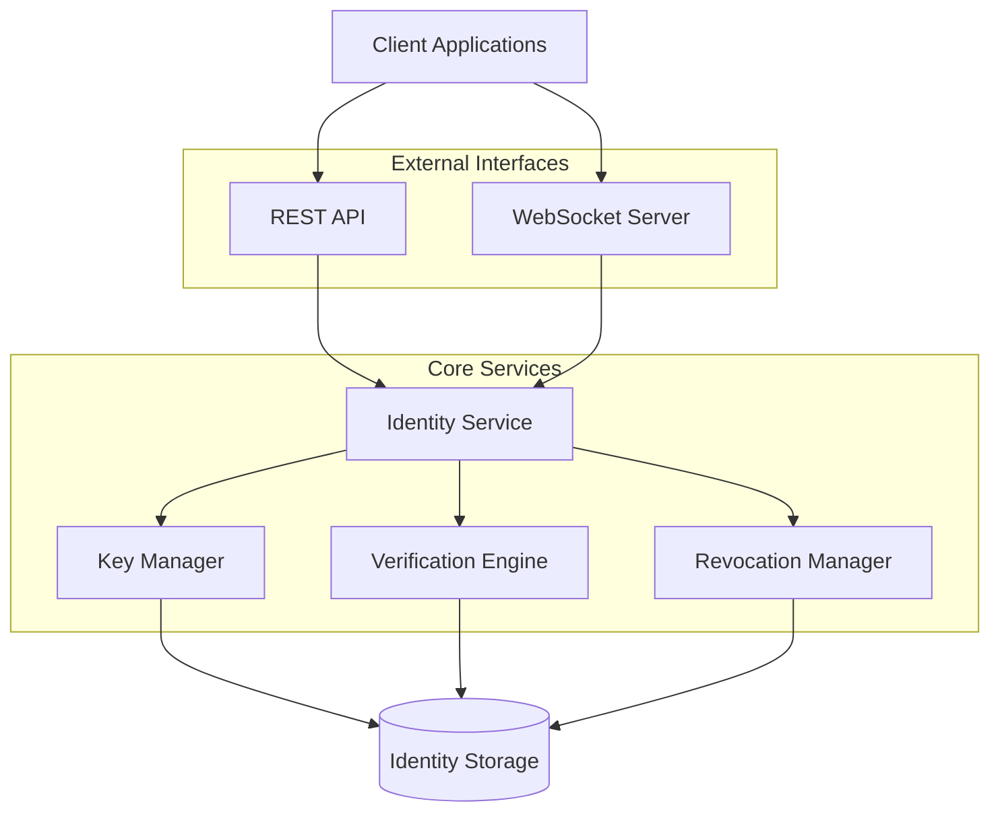

# logline-id Service

This document provides comprehensive information about the LogLine ID microservice, including its architecture, functionality, and implementation details.

## Overview

The logline-id service is a foundational component of the LogLine system, responsible for identity management, cryptographic operations, and verification. It serves as the trust anchor for the entire system, ensuring that all actions within LogLine can be cryptographically verified and traced to authenticated identities.

## Key Features

- **Identity Creation**: Generate and manage cryptographically secure identities
- **Key Management**: Generate, store, and manage Ed25519 key pairs
- **Signature Operations**: Sign and verify documents and transactions
- **Identity Verification**: Validate identity claims and proofs
- **Multi-tenant Support**: Isolation between different identity domains
- **Revocation Management**: Handle identity and key revocation
- **REST API**: Full-featured API for identity operations
- **WebSocket Interface**: Real-time identity verification

## Architecture

### Component Diagram



### Service Layers

1. **External Interface Layer**:
   - REST API for CRUD operations
   - WebSocket server for real-time verification
   - Health check endpoints

2. **Service Layer**:
   - Identity service logic
   - Validation and business rules
   - Orchestration of operations

3. **Domain Layer**:
   - Key management
   - Cryptographic operations
   - Verification logic
   - Revocation handling

4. **Storage Layer**:
   - PostgreSQL persistence
   - Caching mechanisms
   - Data access abstractions

## API Reference

### REST API Endpoints

#### Identity Management

```
POST   /api/v1/identities         # Create new identity
GET    /api/v1/identities         # List identities
GET    /api/v1/identities/:id     # Get identity by ID
PUT    /api/v1/identities/:id     # Update identity
DELETE /api/v1/identities/:id     # Revoke identity
```

#### Key Management

```
POST   /api/v1/keys               # Generate new key pair
GET    /api/v1/keys/:id           # Get public key by ID
PUT    /api/v1/keys/:id/revoke    # Revoke key
```

#### Signature Operations

```
POST   /api/v1/sign               # Sign data
POST   /api/v1/verify             # Verify signature
```

### WebSocket API

The WebSocket interface provides real-time identity verification operations:

```
CONNECT /ws/v1/identity

# Message types:
# - verify_identity
# - identity_status
# - key_revocation
# - signature_verification
```

## Data Models

### LogLineID

```rust
pub struct LoglineIdService {
    pub id: String,               // Unique identifier
    pub public_key: Vec<u8>,      // Ed25519 public key
    pub signature: Vec<u8>,       // Self-signature
    pub creation_timestamp: i64,  // Creation time
    pub revocation_timestamp: Option<i64>, // Revocation time if revoked
    pub metadata: HashMap<String, String>, // Custom metadata
}
```

### KeyPair

```rust
pub struct KeyPair {
    pub id: String,               // Key identifier
    pub public_key: Vec<u8>,      // Ed25519 public key
    pub private_key: Option<Vec<u8>>, // Ed25519 private key (may be omitted)
    pub creation_timestamp: i64,  // Creation time
    pub revocation_timestamp: Option<i64>, // Revocation time if revoked
}
```

### SignatureRequest

```rust
pub struct SignatureRequest {
    pub identity_id: String,      // Identity ID
    pub data: Vec<u8>,            // Data to sign
    pub key_id: Option<String>,   // Optional specific key to use
}
```

### VerificationRequest

```rust
pub struct VerificationRequest {
    pub public_key: Option<Vec<u8>>, // Public key (if not looking up by ID)
    pub identity_id: Option<String>, // Identity ID (if looking up key)
    pub data: Vec<u8>,            // Original data
    pub signature: Vec<u8>,       // Signature to verify
}
```

## Implementation Details

### Cryptographic Operations

LogLine ID uses Ed25519 for digital signatures:

```rust
use ed25519_dalek::{Keypair, PublicKey, SecretKey, Signature, Signer, Verifier};

pub fn generate_keypair() -> Keypair {
    let mut csprng = rand::thread_rng();
    Keypair::generate(&mut csprng)
}

pub fn sign(keypair: &Keypair, message: &[u8]) -> Signature {
    keypair.sign(message)
}

pub fn verify(public_key: &PublicKey, message: &[u8], signature: &Signature) -> bool {
    public_key.verify(message, signature).is_ok()
}
```

### Identity Generation

Creating a new LogLine identity involves:

1. Generate an Ed25519 keypair
2. Create the identity structure with metadata
3. Self-sign the identity with the private key
4. Store the identity and keys
5. Return the public identity information

```rust
pub async fn create_identity(&self, metadata: HashMap<String, String>) -> Result<LogLineID> {
    let keypair = generate_keypair();
    
    // Create identity structure
    let mut id = LogLineID {
        id: generate_unique_id(),
        public_key: keypair.public.to_bytes().to_vec(),
        signature: vec![],  // Will be filled after signing
        creation_timestamp: current_time_millis(),
        revocation_timestamp: None,
        metadata,
    };
    
    // Serialize and sign
    let id_bytes = serialize_identity_for_signing(&id)?;
    let signature = sign(&keypair, &id_bytes);
    id.signature = signature.to_bytes().to_vec();
    
    // Store identity and keypair
    self.storage.store_identity(&id, &keypair).await?;
    
    Ok(id)
}
```

### WebSocket Interface

The WebSocket interface enables real-time identity verification:

```rust
pub async fn handle_websocket_connection(ws: WebSocket, id_service: Arc<IdentityService>) {
    let (mut sender, mut receiver) = ws.split();
    
    while let Some(msg) = receiver.next().await {
        if let Ok(msg) = msg {
            if let Ok(text) = msg.to_str() {
                if let Ok(req) = serde_json::from_str::<WebSocketRequest>(text) {
                    let response = match req.action.as_str() {
                        "verify_identity" => {
                            // Handle verification request
                            handle_verify_identity(&id_service, &req.payload).await
                        }
                        "verify_signature" => {
                            // Handle signature verification
                            handle_verify_signature(&id_service, &req.payload).await
                        }
                        _ => WebSocketResponse {
                            status: "error".to_string(),
                            message: "Unknown action".to_string(),
                            payload: serde_json::Value::Null,
                        }
                    };
                    
                    let response_json = serde_json::to_string(&response).unwrap();
                    sender.send(Message::text(response_json)).await.ok();
                }
            }
        }
    }
}
```

## Storage Implementation

The ID service supports multiple storage backends:

### PostgreSQL Implementation

```rust
pub struct PostgresIdentityStore {
    pool: PgPool,
}

impl IdentityStore for PostgresIdentityStore {
    async fn store_identity(&self, id: &LogLineID, keypair: &Keypair) -> Result<()> {
        // Store identity in database
        sqlx::query!(
            "INSERT INTO identities (id, public_key, signature, creation_timestamp, metadata) 
             VALUES ($1, $2, $3, $4, $5)",
            id.id,
            id.public_key.as_slice(),
            id.signature.as_slice(),
            id.creation_timestamp,
            serde_json::to_value(&id.metadata)?
        )
        .execute(&self.pool)
        .await?;
        
        // Store keypair securely
        sqlx::query!(
            "INSERT INTO keypairs (id, identity_id, public_key, private_key, creation_timestamp) 
             VALUES ($1, $2, $3, $4, $5)",
            generate_unique_id(),
            id.id,
            keypair.public.as_bytes(),
            keypair.secret.as_bytes(),
            id.creation_timestamp
        )
        .execute(&self.pool)
        .await?;
        
        Ok(())
    }
    
    async fn get_identity(&self, id: &str) -> Result<LogLineID> {
        // Retrieve identity from database
        let record = sqlx::query!(
            "SELECT id, public_key, signature, creation_timestamp, revocation_timestamp, metadata 
             FROM identities WHERE id = $1",
            id
        )
        .fetch_one(&self.pool)
        .await?;
        
        // Construct LogLineID from record
        Ok(LogLineID {
            id: record.id,
            public_key: record.public_key.to_vec(),
            signature: record.signature.to_vec(),
            creation_timestamp: record.creation_timestamp,
            revocation_timestamp: record.revocation_timestamp,
            metadata: serde_json::from_value(record.metadata)?,
        })
    }
    
    // Other methods...
}
```

### In-Memory Implementation (for testing)

```rust
pub struct MemoryIdentityStore {
    identities: RwLock<HashMap<String, (LogLineID, Option<Keypair>)>>,
}

impl IdentityStore for MemoryIdentityStore {
    async fn store_identity(&self, id: &LogLineID, keypair: &Keypair) -> Result<()> {
        let mut identities = self.identities.write().await;
        identities.insert(id.id.clone(), (id.clone(), Some(keypair.clone())));
        Ok(())
    }
    
    async fn get_identity(&self, id: &str) -> Result<LogLineID> {
        let identities = self.identities.read().await;
        identities.get(id)
            .map(|(id, _)| id.clone())
            .ok_or_else(|| Error::IdentityNotFound(id.to_string()))
    }
    
    // Other methods...
}
```

## Deployment Configuration

### Docker Configuration

```Dockerfile
FROM rust:1.67 as builder
WORKDIR /usr/src/logline-id
COPY . .
RUN cargo build --release

FROM debian:bullseye-slim
COPY --from=builder /usr/src/logline-id/target/release/logline-id /usr/local/bin/
CMD ["logline-id"]
```

### Railway Configuration

```json
{
  "name": "logline-id",
  "environments": {
    "production": {
      "processes": [
        {
          "name": "web",
          "command": "logline-id",
          "memory": 512,
          "scaling": {
            "min": 1,
            "max": 3
          }
        }
      ],
      "env": {
        "RUST_LOG": "info",
        "ID_SERVICE_PORT": "8081",
        "DATABASE_URL": "${POSTGRESQL_URL}"
      }
    }
  }
}
```

## Client SDK

The ID service provides client libraries for easy integration:

### Rust Client

```rust
pub struct LoglineIdClient {
    base_url: String,
    http_client: Client,
    ws_client: Option<WebSocketClient>,
}

impl LoglineIdClient {
    pub fn new(base_url: &str) -> Self {
        Self {
            base_url: base_url.to_string(),
            http_client: Client::new(),
            ws_client: None,
        }
    }
    
    pub async fn create_identity(&self, metadata: HashMap<String, String>) -> Result<LogLineID> {
        let response = self.http_client
            .post(&format!("{}/api/v1/identities", self.base_url))
            .json(&CreateIdentityRequest { metadata })
            .send()
            .await?;
            
        if response.status().is_success() {
            let id = response.json::<LogLineID>().await?;
            Ok(id)
        } else {
            Err(Error::ApiError(response.status().as_u16(), response.text().await?))
        }
    }
    
    // Other methods...
}
```

## Migration from Monolithic Implementation

The ID service is extracted from the `infra/id/` module of the monolithic LogLine implementation:

1. **Code Migration**:
   - Extract `logline_id.rs` core functionality
   - Refactor to remove circular dependencies
   - Add REST API and WebSocket interfaces

2. **Database Migration**:
   - Create schema for standalone service
   - Migrate existing identity data
   - Add indexes for performance

3. **Testing Strategy**:
   - Unit tests for core functionality
   - Integration tests for API endpoints
   - Compatibility tests with existing code

## Relationship with Other Microservices

The ID service is a foundational service that others depend on:

- **logline-timeline**: Uses ID service for identity verification
- **logline-engine**: Verifies identities during execution
- **logline-federation**: Manages trust between federated identities
- **logline-api**: Uses ID service for authentication
- **logline-onboarding**: Extends ID service with verification workflows

## Security Considerations

1. **Private Key Protection**:
   - Private keys are encrypted at rest
   - Keys never leave the service boundary
   - All signing operations happen server-side

2. **Authentication and Authorization**:
   - API endpoints require authentication
   - Fine-grained access control for identity operations
   - Audit logging for security events

3. **Network Security**:
   - HTTPS for all API endpoints
   - WebSocket connections use secure WebSockets (wss://)
   - Rate limiting to prevent abuse

## Performance Considerations

1. **Caching**:
   - Identity information is cached for fast verification
   - Redis cache for high-volume scenarios

2. **Connection Pooling**:
   - Database connection pooling for high throughput
   - WebSocket connection management

3. **Scaling**:
   - Horizontal scaling through stateless design
   - Database read replicas for high-volume deployments

## Conclusion

The LogLine ID service provides a robust foundation for identity management within the LogLine ecosystem. By isolating identity functionality into its own microservice, we achieve better separation of concerns, scalability, and maintainability while eliminating circular dependencies from the monolithic architecture.